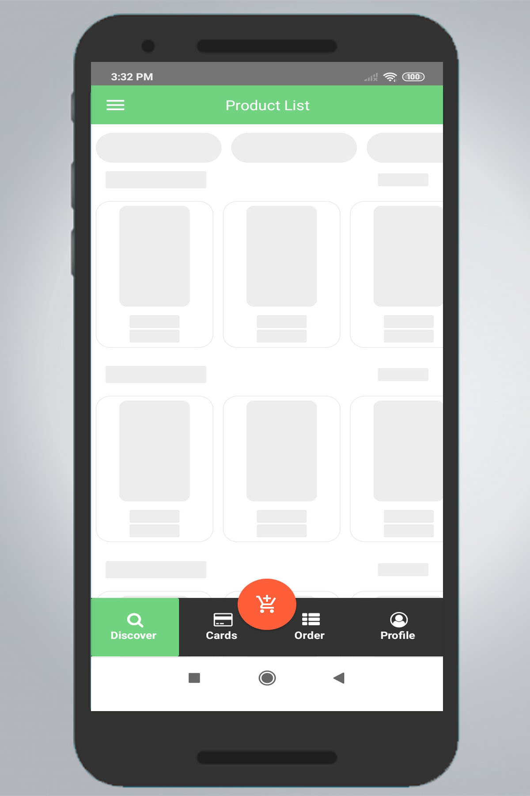
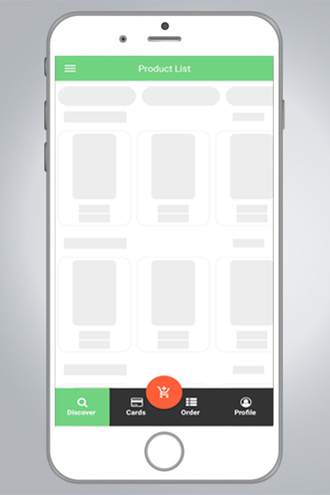

# React Native Preload Documentation

<p float="center">
  
     
</p>

## Installation
 ` npm i react-native-preload `

## Import
```js
import {
  Skeleton
} from 'react-native-preload'

```

## Quick Example
```jsx
    <Skeleton Width={70} Height={30} BorderRadius={4} />
```

## Skeleton Properties Detail
Define a `Skeleton` screen with following properties as such:


| Property        | Type           | Description  |
| ------------- |-------------| -----|
| Width | Number | Defines the width of the skeleton to be shown  |
| Height | Number | Defines the height of the skeleton to be shown  |
| BorderRadius | Number | Defines the borderRadius of the skeleton to be shown |

## Responsive Skeleton Screen 
To render a responsive screen, use `Dimensions` react-native library to get the width of the screen of your device like such
```js
import { Dimensions } from 'react-native'
const SCREEN_WIDTH = Dimensions.get('window').width
const SCREEN_HEIGHT = Dimensions.get('window').height
```

## Skeleton Screen
```jsx
<View style={{ width: SCREEN_WIDTH / 5, 
               height: SCREEN_HEIGHT / 5.8,
               backgroundColor: '#d8d8d8',
               borderRadius:8, }} >
    <Skeleton Width={70} Height={SCREEN_HEIGHT / 5.8} BorderRadius={8} />
</View>
```

## Skeleton Properties Detail
Define a `Skeleton` screen with following properties as such:


| Property        | Type           | Description  |
| ------------- |-------------| -----|
| Width | Number | Defines the width of the skeleton to be shown  |
| Height | Number | Defines the height of the skeleton to be shown  |
| BorderRadius | Number | Defines the borderRadius of the skeleton to be shown |